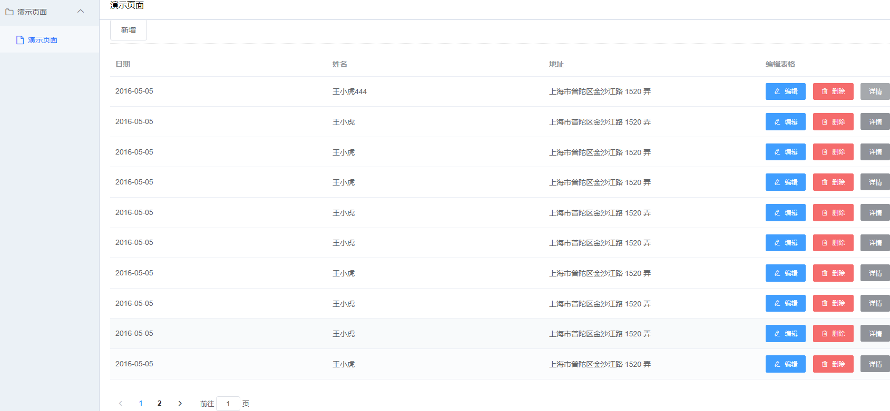

[简体中文](README.md) | [English](README.en.md)

# husky — Django 之入门 CMDB 系统

一个用 Django 从零搭建 CMDB 系统的入门教程项目：覆盖 MVC 模板渲染和 MVVM（前后端分离）两种开发方式，跟着 6 篇教程文档走一遍，就能独立写出一个包含用户认证、主机资产管理和动态菜单的简单 CMDB。

[](https://www.python.org/)
[](https://www.djangoproject.com/)
[](LICENSE)

## 项目介绍

husky 是" Django 之入门 CMDB 系统"系列教程的配套代码。教程从基础环境讲起，依次实现前端模板、登录注销、增删改查，最后过渡到前后端分离（Vue + Django REST Framework），适合有 Python 基础、想入门 Django Web 开发和运维平台开发的读者。

这是一个**教程项目**：代码结构和依赖版本以教学可读性优先（如 Django 3.0、MySQL 5.7 时代的用法），适合学习和二次改造，不建议直接用于生产环境。

## ✨ 功能特性

- 基于 Django Auth 的用户登录/注销，扩展 AbstractUser 用户表，支持自助修改密码
- 主机（ECS）资产管理：主机名、云厂商（阿里云/腾讯云/华为云/亚马逊等）、实例 ID、系统版本、CPU/内存、内外网 IP 等字段的增删改查
- 资产列表分页（django-pure-pagination）与条件搜索
- 基于 Django Permission 的视图级权限控制（`PermissionRequiredMixin`）
- 前后端分离接口：DRF Token 登录 + 图形验证码（缓存校验，180 秒有效期）
- 动态菜单：按用户权限返回菜单与路由数据（`router` 应用）
- DRF Token 认证（`/token`）与 Swagger API 文档（`/docs`）
- `workflows` 应用：工单流程（Workflow/State/Transition 等）数据模型与处理逻辑，可作流程引擎学习参考

## 🛠 技术栈

| 层 | 选型 |
| --- | --- |
| 后端 | Python、Django 3.0.4、Django REST Framework、MySQL（PyMySQL） |
| 前端 | Bootstrap 3（模板渲染）+ Vue/D2Admin（前后端分离篇） |
| 主要依赖 | django-bootstrap3、django-pure-pagination、django-cors-headers、captcha、django-filter、django-crispy-forms、django-rest-swagger |

## 🚀 快速开始

教程环境见 [doc/1.md](doc/1.md)（CentOS 7.6 / Python 3.6 / MySQL 5.7），本地体验步骤：

```bash
git clone https://github.com/hequan2017/husky.git
cd husky
pip install -r requirements.txt

# 修改 husky/settings.py 中 DATABASES 的 MySQL 连接信息（库名 husky）
python manage.py makemigrations system asset router workflows
python manage.py migrate
python manage.py createsuperuser
python manage.py runserver 0.0.0.0:8000
```

- 管理后台：<http://127.0.0.1:8000/admin/>
- 系统首页：<http://127.0.0.1:8000/>
- API 文档：<http://127.0.0.1:8000/docs>

## 📁 目录结构

```text
husky/
├── system/       # 用户、登录注销、修改密码
├── asset/        # 主机（ECS）资产增删改查
├── router/       # 前后端分离登录、验证码、动态菜单接口
├── workflows/    # 工单流程数据模型与处理逻辑
├── templates/    # Django 模板
├── static/       # 静态资源（Bootstrap、DataTables 等）
└── doc/          # 6 篇教程文档
```

## 📸 截图




## 📚 教程目录

- [Django之入门 CMDB系统  (一) 基础环境](doc/1.md)
- [Django之入门 CMDB系统  (二) 前端模板](doc/2.md)
- [Django之入门 CMDB系统  (三) 登录注销](doc/3.md)
- [Django之入门 CMDB系统  (四) 增删改查](doc/4.md)
- [Django之入门 CMDB系统  (五) 前后端分离之前端](doc/5.md)
- [Django之入门 CMDB系统  (六) 前后端分离之后端](doc/6.md)

## 动态菜单与工单

* 动态菜单：实现于 `router` 应用，参考文档：<https://mp.weixin.qq.com/s?__biz=MzU1OTYzODA4Mw==&mid=2247484250&idx=1&sn=981024ac0580d8a3eba95742bd32b268&chksm=fc157076cb62f960aa9d88e38e584adfd3025f635d296a670f9f8c68a57229e9bd4a1b3e9d20&mpshare=1&scene=1&srcid=&sharer_sharetime=1582904507372&sharer_shareid=ec5f8f73cf3846c67538a33aa69ae2ae#rd>
* 工单：参考 `workflows` 应用，另有文章：<https://mp.weixin.qq.com/s?__biz=MzU1OTYzODA4Mw==&mid=2247484255&idx=1&sn=0a9b4cfe2eb8adc33ae4cf2d581f790a&chksm=fc157073cb62f9657336abb43ea0b9e3d2e778ae5e43739ce1a3c33931968004993f1bdc87aa&mpshare=1&scene=1&srcid=&sharer_sharetime=1583566215427&sharer_shareid=ec5f8f73cf3846c67538a33aa69ae2ae#rd>

## 🔗 相关项目

* 教程项目地址: <https://github.com/hequan2017/husky/>
* 前后端分离前端: [hequan2017/panda](https://github.com/hequan2017/panda/)，后端: [hequan2017/pandaAdmin](https://github.com/hequan2017/pandaAdmin)（见 doc/5.md、doc/6.md）
* 作者其他项目: [hequan2017/go-webssh](https://github.com/hequan2017/go-webssh)

## 作者 / 交流

> 作者: 何全，github地址: <https://github.com/hequan2017>   QQ交流群: 620176501

## 📄 License

[MIT](LICENSE)
