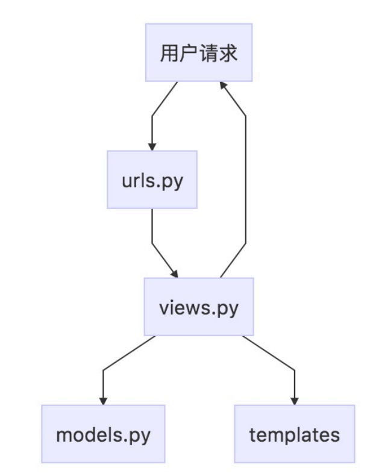

# Django之入门 CMDB系统  (三) 登录注销
---
## 前言

> 作者: 何全，github地址: https://github.com/hequan2017   QQ交流群: 620176501

> 通过此教程完成从零入门，能够独立编写一个简单的CMDB系统。

> 目前主流的方法开发方式，分为2种：mvc 和 mvvc方式。本教程为 mvc 方式，即 django负责渲染html。后面会推出 mvvc(前后端分离)的入门教程。

> 教程项目地址: https://github.com/hequan2017/husky/

> 教程文档地址: https://github.com/hequan2017/husky/tree/master/doc

## 首页

> pycharm : 菜单栏 tools --> 选择  run  manage.py task

> manage.py@husky >  startapp  system    # 创建一个APP  ，用来管理系统

> 具体内容请看实际页面，下面只是把重点代码 进行展示。


---


* husky/urls.py

```python
from django.contrib import admin
from django.urls import path
from system.views import index
from django.conf.urls import include   

urlpatterns = [
    path('admin/', admin.site.urls),
    path('', index),
    path('index', index, name="index"),
    path('system/', include('system.urls', namespace='system')),  ## 引入 system 的urls 文件
]
```

* system/__init.py   新建空白文件

* system/views.py     负责逻辑处理

```python
@login_required(login_url="/system/login")
def index(request):
    """
    首页
    :param request:
    :return:
    """
    return render(request, 'system/index.html',{})  #render  结合一个给定的模板和一个给定的上下文字典，并返回一个渲染后的 HttpResponse 对象。
```


## 登录

* system/modesl.py     表结构

> 继承user表结构,重建user表

>⽤用⼀一个 Python 类来描述数据表, 我们 称之为 模型(model) 。 运⽤用这个类,你可以通过简单的
Python 的代码来创建、检索、更更新、删除 数据库中的记录⽽而⽆无需写⼀一条⼜又⼀一条的SQL语句句，这
就是传说中的ORM(Object Relation Mapping)


```python
from django.db import models
from django.contrib.auth.models import AbstractUser  


class Users(AbstractUser):  # AbstractUser  重写 user 需要集成表
    """
    基于django表  添加字段 , 如有需要调用user的情况,请使用此表
    """
    position = models.CharField(max_length=64, verbose_name='职位信息', blank=True, null=True)
    avatar = models.CharField(max_length=256, verbose_name='头像', blank=True, null=True)
    mobile = models.CharField(max_length=11, verbose_name='手机', blank=True, null=True)

    class Meta:
        db_table = 'users'
        verbose_name = '用户信息'
        verbose_name_plural = verbose_name

    def __str__(self):
        return self.username

```
> 因为更改了默认的user表，需要先把库删了。再进行重建。


```shell script
drop database husky;
create database husky;

```

> pycharm : 菜单栏 tools --> 选择  run  manage.py task

> makemigrations    生成数据文件
 
> migrate           根据文件，执行生成表结构
 
> createsuperuser

* settings.py    增加系统配置

```python
import sys
INSTALLED_APPS = [   # 这里填写 创建的app  ,结构为， 一个项目 可以有多个APP
    "system",
    'bootstrap3' 
]

AUTH_USER_MODEL = 'system.users'
AUTHENTICATION_BACKENDS = ('system.views.CustomBackend',)  ## 重新登录验证,增加邮箱名字也可以用作登录

SESSION_ENGINE = 'django.contrib.sessions.backends.db'
SESSION_COOKIE_SAMESITE = 'Lax'
CSRF_COOKIE_SAMESITE = 'Lax'
SESSION_COOKIE_AGE = 432000
LOGIN_URL = '/auth/login'
LANGUAGE_CODE = 'zh-Hans'

TIME_ZONE = 'Asia/Shanghai'

USE_I18N = True
USE_L10N = False
USE_TZ = True
DATETIME_FORMAT = 'Y-m-d H:i:s'
DATE_FORMAT = 'Y-m-d'

# logging
LOGGING = {
    'version': 1,
    'disable_existing_loggers': False,
    'formatters': {
        'verbose': {
            'format': '[argus] %(levelname)s %(asctime)s %(module)s %(message)s'
        }
    },
    'handlers': {
        'console': {
            'level': 'DEBUG',
            'class': 'logging.StreamHandler',
            'stream': sys.stdout,
            'formatter': 'verbose'
        },
    },
    'loggers': {
        'tasks': {
            'handlers': ['console'],
            'level': 'DEBUG',
            'propagate': True,
        },
        'asset': {
            'handlers': ['console'],
            'level': 'DEBUG',
            'propagate': True,
        },
    },
}

# 表格table
PAGINATION_SETTINGS = {
    'PAGE_RANGE_DISPLAYED': 3,
    'MARGIN_PAGES_DISPLAYED': 2,
    'SHOW_FIRST_PAGE_WHEN_INVALID': True,
}

# 表格table 一页 展示数据
DISPLAY_PER_PAGE = 15

```

---

* system/views.py

> View 包含了了项⽬目的业务逻辑，我们称之为视图，也是我们开发过程中主要编写的内容
```python
def login_view(request):
    """
    登录
    :param request: username,password
    :return:
    """

    error_msg = "用户名或密码错误,或者被禁用,请重试"

    if request.method == "GET":
        return render(request, 'system/login.html', {'error_msg': error_msg, })

    if request.method == "POST":
        u = request.POST.get("username")
        p = request.POST.get("password")
        user = authenticate(request, username=u, password=p)
        if user is not None:
            if user.is_active:
                login(request, user)
                request.session['is_login'] = True
                login_ip = request.META['REMOTE_ADDR']
                return redirect('/index')  ## 重定向到的一个具体的网址
            else:
                return render(request, 'system/login.html', {'error_msg': error_msg, })
        else:
            return render(request, 'system/login.html', {'error_msg': error_msg, })


class CustomBackend(ModelBackend):
    """
    用户名字/邮箱名字 登录
    :param request:
    :return:
    """
    def authenticate(self, request, username=None, password=None, **kwargs):
        try:
            user = Users.objects.get(Q(username=username) | Q(email=username))
            if user.check_password(password):
                return user
        except Exception as e:
            logger.error(e)
            return None


```
* system/urls.py   路由 

> 指出了了什什么样的 URL 调⽤用什什么的视图。 在这个例例⼦子中 /latest/ URL 将会调⽤用 latest_books() 这
个函数。 换句句话说,如果你的域名是example.com,任何⼈人浏览⽹网址 http://example.com/latest/ 将
会调⽤用 latest_books()这个函数返回结果给⽤用户
```python
from django.urls import path
from system.views import login_view

app_name = "system"

urlpatterns = [
    path('login', login_view, name="login")
]
```

* templates/system/login.html

> 简单来说就是html 模板,它描述了了项⽬目的界⾯面结构。 模板引擎也内置了了⼀一些tag 。

> 登录不继承 base.html ,为一个单独页面
```html
  <h3>欢迎登录 系统</h3>
        <form class="m-t" role="form" action="" method="POST">
            
            <div class="form-group">
                <input type="text" name="username" class="form-control" placeholder="用户名" required="">
            </div>
            <div class="form-group">
                <input type="password" name="password" class="form-control" placeholder="密码" required="">
            </div>
            <button type="submit" class="btn btn-primary block full-width m-b">登录</button>

            <a href="#">
                <span style="color: red;"> {{ error_msg }}</span><br>
              不推荐使用IE/360浏览器(兼容模式)浏览!<br />

            </a>
            <div id="login_container"></div>


        </form>
```

## 注销

* system/views.py

```python
def logout_view(request):
    """
    注销
    :param request:
    :return:
    """
    logout(request)
    return redirect('system:login')

```

* system/urls.py

```python
path('logout', logout_view, name="logout"),
```

* templates/base/_navbar-static-top.html

```html
 <li>
        <a href="">
                    <i class="fa fa-sign-out"></i> 注销
                </a>
            </li>
```

## 更改密码
* system/form.py

> 用户表单是Web端的一项基本功能,大而全的Django框架中自然带有现成的基础form对象,本文就Python的Django框架中forms表单类的使用方法详解。

* Form表单的功能
    * 自动生成HTML表单元素
    * 检查表单数据的合法性
    * 如果验证错误，重新显示表单（数据不会重置）
    * 数据类型转换（字符类型的数据转换成相应的Python类型）


```python
from django import forms


class UserPasswordForm(forms.Form):
    old_password = forms.CharField(max_length=128, widget=forms.PasswordInput, label='旧密码')
    new_password = forms.CharField(min_length=8, max_length=128, widget=forms.PasswordInput, label='新密码',
                                   help_text="* 你的密码必须包含至少 8 个字符,不能是大家都爱用的常见密码,不能全部为数字")
    confirm_password = forms.CharField(min_length=8, max_length=128, widget=forms.PasswordInput, label='确认密码',
                                       help_text="* 和上面密码一致")

    def __init__(self, *args, **kwargs):
        self.instance = kwargs.pop('instance')
        super().__init__(*args, **kwargs)

    def clean_old_password(self):
        old_password = self.cleaned_data['old_password']
        if not self.instance.check_password(old_password):
            raise forms.ValidationError('旧密码错误')
        return old_password

    def clean_confirm_password(self):
        new_password = self.cleaned_data['new_password']
        confirm_password = self.cleaned_data['confirm_password']

        if new_password != confirm_password:
            raise forms.ValidationError('新密码与确认密码不一致')
        return confirm_password

    def save(self):
        password = self.cleaned_data['new_password']
        self.instance.set_password(password)
        self.instance.save()
        return self.instance
```

* system/views.py

```python
class UserPasswordUpdateView(LoginRequiredMixin, UpdateView):
    """
    修改密码
    :param request:
    :return:
    """
    template_name = 'system/password.html'
    model = Users
    form_class = UserPasswordForm
    success_url = reverse_lazy('system:logout')

    def get_object(self, queryset=None):
        return self.request.user

    def get_context_data(self, **kwargs):
        return super().get_context_data(**kwargs)

    def get_success_url(self):
        return super().get_success_url()
```

* system/urls.py

```python
path('password_update', UserPasswordUpdateView.as_view(), name="password_update"),
```
* templates/system/password.html
```html
 <div class="wrapper wrapper-content animated fadeInRight">
    <form method="post" class="form-horizontal" action="" enctype="multipart/form-data">
        

        
            <div class="alert alert-danger" style="margin: 20px auto 0px">
                {{ form.non_field_errors }}
            </div>
        
        <div class="form-group">
            <div class="col-sm-10 col-sm-offset-0"> {{ msg }}
                
                
                </div>
        </div>

        <div class="hr-line-dashed"></div>
        <div class="form-group">
            <div class="col-sm-4 col-sm-offset-3">

                <button id="submit_button" class="btn btn-primary" type="submit">提交</button>
                <button class="btn btn-white" type="reset">重置</button>
            </div>
        </div>
    </form>
</div>
```

## 后台
* system/admin.py

> 后台界面配置文件，每个APP 可以创建一个

```python
from django.contrib import admin
from system.models import Users
from django.contrib.auth.admin import UserAdmin


class UsersAdmin(UserAdmin):
    fieldsets = (
        (None, {'fields': ('username', 'password')}),
        ('基本信息', {'fields': ('first_name', 'last_name', 'email')}),
        ('权限', {'fields': ('is_active', 'is_staff', 'is_superuser', 'groups', 'user_permissions')}),
        ('登录时间', {'fields': ('last_login', 'date_joined')}),
        ('其他信息', {'fields': (
            'position', 'avatar', 'mobile',)}),
    )

    @classmethod
    def show_group(self, obj):
        return [i.name for i in obj.groups.all()]

    @classmethod
    def show_user_permissions(self, obj):
        return [i.name for i in obj.user_permissions.all()]

    list_display = ('username', 'show_group', 'show_user_permissions')
    list_display_links = ('username',)
    search_fields = ('username',)
    filter_horizontal = ('groups', 'user_permissions')


admin.site.register(Users, UsersAdmin)
admin.site.site_header = '管理后台'
admin.site.site_title = admin.site.site_header

```

## 其他

* migrations 目录为存放django自动生成的表结构文件，系统会根据生成的这些文件 创建数据库表，如要重新生成数据库，需要把里面的生成文件删除掉。