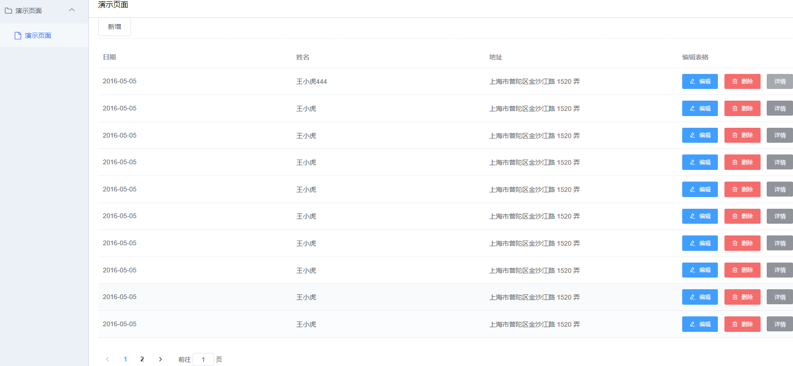

# Django之入门 CMDB系统  (五) 前后端分离之前端
---
## 前言

> 作者: 何全，github地址: https://github.com/hequan2017   QQ交流群: 620176501

> 通过此教程完成从零入门，能够独立编写一个简单的CMDB系统。

> 目前主流的方法开发方式，分为2种：mvc 和 mvvc方式。本教程为 mvvc(前后端分离)的入门教程。

> 教程项目地址: https://github.com/hequan2017/panda/

> 教程文档地址: https://github.com/hequan2017/pandaAdmin


## 说明

* 架构框架选择
    * vue (入门简单，自学可以跟着官网例子入门)
    * d2Admin (基于element,样式外观好看，例子较多)
* 开发工具
    * vs code 

> 相较于react, vue入门更简单，基于模板语法，适合从mvc方式 循序渐进到 mvvc方式。

> 模板选择为 基于element的模板. iview现在已经转为收费方式，不太适合个人开发者练习使用。antd vue版本 没有合适的 admin模板，所以放弃了.

> vue-element-admin 和 d2admin 差不多，资料文档都非常全。看个人选择。

## demo


## 框架文档

* vue
    * https://cn.vuejs.org/v2/guide/  
    * axios     ajax 发送请求 获取信息
    * store     获取到的信息保存
    * router    路由跳转
    
* https://fairyever.com/d2-admin/doc/zh/   #具体模板详细 可以 看这个文档，非常详细

* 下载基础模板

> git clone  https://github.com/d2-projects/d2-admin-start-kit

```
├─.DS_Store 
├─.browserslistrc ------------------- // 目标浏览器配置
├─.env ------------------------------ // 基础环境变量配置
├─.env.development ------------------ // 开发模式下的环境变量配置
├─.env.netlify ---------------------- // Netlify 构建时的环境变量
├─.env.nomock ----------------------- // 无 mock 数据构建模式下的环境变量
├─.env.travis ----------------------- // Travis 构建时的环境变量
├─.eslintignore --------------------- // ESLint 的忽略目录配置
├─.eslintrc.js ---------------------- // ESLint 的配置文件
├─.github --------------------------- // Github 配置
│ └─ISSUE_TEMPLATE ------------------ // GitHub issue 模板
├─.gitignore ------------------------ // git 的忽略配置
├─.postcssrc.js --------------------- // postcss 插件设置
├─.travis.yml ----------------------- // Travis 配置文件
├─LICENSE --------------------------- // 开源协议
├─README.md ------------------------- // 介绍
├─README.zh.md ---------------------- // 中文介绍 在码云仓库下自动加载这个文件
├─babel.config.js ------------------- // babel 设置
├─cdnrefresh-dirs.txt --------------- // 自动构建后在七牛 CDN 上刷新的目录
├─d2-admin.babel -------------------- // 多国语设置软件 BabelEdit 的项目文件
├─doc ------------------------------- // 文档素材
│ └─image 
├─jest.config.js -------------------- // 单元测试配置
├─jsconfig.json --------------------- // 指定根文件和 JavaScript 语言服务提供的功能选项
├─package-lock.json ----------------- // 锁定依赖版本
├─package.json ---------------------- // 项目信息和依赖
├─public ---------------------------- // 静态资源文件夹，不经过 webpack 处理
│ ├─html ---------------------------- // 用于演示加载静态页面的资源
│ ├─icon.ico ------------------------ // 网站图标
│ ├─image 
│ │ ├─baidu-pan-logo.png 
│ │ ├─loading ----------------------- // index.html 使用的加载图标
│ │ └─theme ------------------------- // 主题图片资源
│ │   ├─d2 
│ │   ├─line 
│ │   ├─star 
│ │   ├─tomorrow-night-blue 
│ │   └─violet 
│ ├─index.html ---------------------- // 网站的基础页面模板
│ ├─lib ----------------------------- // 静态依赖
│ │ └─UEditor ----------------------- // 编辑器
│ └─markdown ------------------------ // 用于展示 Markdown 远程加载资源的文件
├─qiniu-config ---------------------- // 用于构建展示网站的七牛设置
├─qshell ---------------------------- // 七牛 SDK
├─src ------------------------------- // 主要的代码目录
│ ├─App.vue ------------------------- // 项目根组件
│ ├─api ----------------------------- // 请求接口
│ ├─assets -------------------------- // 资源文件夹
│ │ ├─style ------------------------- // 样式资源
│ │ │ ├─animate --------------------- // 页面过渡动画
│ │ │ ├─fixed ----------------------- // 覆盖一些组件库的默认样式
│ │ │ ├─public-class.scss ----------- // 导出可以直接使用的 class
│ │ │ ├─public.scss ----------------- // 导出所有公用的 scss 资源
│ │ │ ├─theme ----------------------- // 主题样式相关
│ │ │ │ ├─d2 
│ │ │ │ ├─line 
│ │ │ │ ├─register.scss ------------- // 注册所有主题样式
│ │ │ │ ├─star 
│ │ │ │ ├─theme-base.scss ----------- // 每个主题共用的样式
│ │ │ │ ├─theme.scss ---------------- // 每个主题特有的设置
│ │ │ │ ├─tomorrow-night-blue 
│ │ │ │ └─violet 
│ │ │ └─unit ------------------------ // scss 的基础变量
│ │ └─svg-icons --------------------- // svg 图标
│ │   ├─icons ----------------------- // 用来存放图标的文件夹
│ │   └─index.js -------------------- // 自动导入所有符合条件的图标
│ ├─components ---------------------- // 组件
│ │ ├─d2-container 
│ │ ├─d2-container-frame 
│ │ ├─d2-count-up 
│ │ ├─d2-highlight 
│ │ ├─d2-icon 
│ │ ├─d2-icon-select 
│ │ ├─d2-icon-svg 
│ │ ├─d2-icon-svg-select 
│ │ ├─d2-link-btn 
│ │ ├─d2-markdown 
│ │ ├─d2-mde 
│ │ ├─d2-module-index-banner 
│ │ ├─d2-module-index-menu 
│ │ ├─d2-quill 
│ │ ├─d2-ueditor 
│ │ ├─highlight-styles -------------- // 代码高亮样式
│ │ └─index.js ---------------------- // 组件注册
│ ├─i18n.js ------------------------- // 国际化配置
│ ├─layout -------------------------- // 布局
│ │ └─header-aside ------------------ // 具有顶栏加侧边栏的布局
│ ├─libs ---------------------------- // 一些通用的方法
│ │ ├─util.cookies.js 
│ │ ├─util.db.js 
│ │ ├─util.import.development.js ---- // 开发环境下使用的页面导入方法
│ │ ├─util.import.production.js ----- // 开发环境下使用的页面导入方法
│ │ ├─util.js 
│ │ └─util.log.js 
│ ├─locales ------------------------- // 国际化语言配置
│ │ ├─en.json 
│ │ ├─ja.json 
│ │ ├─zh-chs.json 
│ │ └─zh-cht.json 
│ ├─main.js ------------------------- // 程序主入口
│ ├─menu ---------------------------- // 静态的菜单数据
│ │ ├─index.js 
│ │ └─modules 
│ │   ├─demo-business.js 
│ │   ├─demo-charts.js 
│ │   ├─demo-components.js 
│ │   ├─demo-d2-crud.js 
│ │   ├─demo-element.js 
│ │   ├─demo-frame.js 
│ │   ├─demo-playground.js 
│ │   └─demo-plugins.js 
│ ├─mock 
│ │ ├─api --------------------------- // 需要注册的接口
│ │ ├─d2-mock ----------------------- // 简化接口注册的工具
│ │ └─index.js ---------------------- // mock 数据自动注册
│ ├─plugin -------------------------- // 插件
│ │ ├─axios ------------------------- // 网络请求
│ │ ├─d2admin ----------------------- // 统一注册系统必须的资源
│ │ ├─error ------------------------- // 错误拦截
│ │ ├─log --------------------------- // 日志
│ │ └─open -------------------------- // 新窗口打开
│ ├─router -------------------------- // 路由
│ │ ├─index.js ---------------------- // 注册路由以及设置拦截规则
│ │ ├─modules ----------------------- // 预先设置好的静态路由
│ │ │ ├─business.js 
│ │ │ ├─charts.js 
│ │ │ ├─components.js 
│ │ │ ├─d2-crud.js 
│ │ │ ├─element.js 
│ │ │ ├─frame.js 
│ │ │ ├─playground.js 
│ │ │ └─plugins.js 
│ │ └─routes.js --------------------- // 导入所有路由
│ ├─setting.js ---------------------- // 全局设置
│ ├─store --------------------------- // vuex
│ │ ├─index.js ---------------------- // vuex 注册主入口
│ │ └─modules ----------------------- // 模块目录
│ │   └─d2admin --------------------- // 系统自带模块，业务模块建议在同级新建
│ │     ├─index.js ------------------ // 模块主入口
│ │     └─modules ------------------- // 子模块
│ │       ├─account.js -------------- // 用户身份
│ │       ├─color.js ---------------- // 主题颜色
│ │       ├─db.js ------------------- // 本地数据库
│ │       ├─fullscreen.js ----------- // 全屏
│ │       ├─gray.js ----------------- // 灰度模式
│ │       ├─log.js ------------------ // 日志
│ │       ├─menu.js ----------------- // 菜单
│ │       ├─page.js ----------------- // 多页面控制
│ │       ├─releases.js ------------- // 版本
│ │       ├─search.js --------------- // 全局搜索
│ │       ├─size.js ----------------- // 全局尺寸
│ │       ├─theme.js ---------------- // 主题
│ │       ├─transition.js ----------- // 过渡效果
│ │       ├─ua.js ------------------- // 浏览器信息
│ │       └─user.js ----------------- // 用户信息
│ └─views --------------------------- // 页面视图
│   ├─demo -------------------------- // 演示页面
│   │ ├─business -------------------- // 业务页面演示
│   │ │ ├─index 
│   │ │ ├─issues 
│   │ │ └─table 
│   │ ├─charts ---------------------- // 图表
│   │ │ ├─index 
│   │ │ └─list 
│   │ │   ├─_data 
│   │ │   ├─_mixin 
│   │ │   ├─bar 
│   │ │   ├─candle 
│   │ │   ├─funnel 
│   │ │   ├─gauge 
│   │ │   ├─heatmap 
│   │ │   ├─histogram 
│   │ │   ├─line 
│   │ │   ├─map 
│   │ │   ├─pie 
│   │ │   ├─radar 
│   │ │   ├─ring 
│   │ │   ├─sankey 
│   │ │   ├─scatter 
│   │ │   ├─tree 
│   │ │   └─waterfall 
│   │ ├─components ------------------ // 内置组件演示
│   │ │ ├─container 
│   │ │ ├─contextmenu 
│   │ │ ├─countup 
│   │ │ ├─editor-quill 
│   │ │ ├─editor-simpleMDE 
│   │ │ ├─editor-ueditor 
│   │ │ ├─highlight 
│   │ │ ├─icon 
│   │ │ ├─index 
│   │ │ ├─json-tree 
│   │ │ ├─layout 
│   │ │ └─markdown 
│   │ ├─d2-crud --------------------- // D2CRUD 表格封装演示
│   │ ├─element --------------------- // Element UI 组件
│   │ ├─frame ----------------------- // 嵌套第三方页面演示
│   │ ├─playground ------------------ // 试验台
│   │ │ ├─add-routes ---------------- // 动态添加路由
│   │ │ ├─db ------------------------ // 数据持久化
│   │ │ ├─env ----------------------- // 环境变量
│   │ │ ├─index 
│   │ │ ├─locales ------------------- // 多国语
│   │ │ ├─log ----------------------- // 日志
│   │ │ ├─page-argu ----------------- // 页面参数
│   │ │ ├─page-cache ---------------- // 页面缓存
│   │ │ └─store --------------------- // 全局状态控制
│   │ │   ├─fullscreen 
│   │ │   ├─gray 
│   │ │   ├─menu 
│   │ │   ├─page 
│   │ │   ├─size 
│   │ │   ├─theme 
│   │ │   ├─transition 
│   │ │   └─ua 
│   │ └─plugins --------------------- // 插件演示
│   │   ├─better-scroll 
│   │   ├─clipboard-polyfill 
│   │   ├─day 
│   │   ├─export 
│   │   ├─import 
│   │   ├─index 
│   │   ├─js-cookie 
│   │   └─mock 
│   └─system ------------------------ // 系统页面
│     ├─error 
│     ├─function 
│     │ ├─redirect ------------------ // 重定向
│     │ └─refresh ------------------- // 刷新
│     ├─index 
│     ├─log 
│     └─login 
├─tests ----------------------------- // 单元测试
├─tools 
│ └─vue-filename-injector ----------- // 用于对每个组件注入源代码位置的插件
└─vue.config.js --------------------- // vue-cli3 的项目配置文件
```

## 登录部分

* src/modules/d2admin/modules/account.js  #主要为 前端登录信息 状态 保存和读取


```js
try {
      AccountLoginInfo(res.token)
        .then(resinfo => {
          const data = resinfo.data    /*  获取后端用户信息*/
          console.log(resinfo)
          dispatch(               
            'd2admin/user/set',
            {
              name: resinfo.name
            },
            { root: true }
          )
          resolve(data)
        })
        .catch(err => {
          reject(err)
        })
    } catch (error) {
      reject(error)
    }
```

* src/api/sys.login.js  # 设置获取 token 和 info

```js
import request from '@/plugin/axios'


export function AccountLogin (data) {
  return request({
    url: '/api/token',
    method: 'post',
    data
  })
}
export const AccountLoginInfo = token => {
  return request({
    url: '/system/api/user_info',
    data: {
      token
    },
    method: 'post'
  })
}
```

* 登录token拦截设置  src\plugin\axios\index.js

```js
// 请求拦截器
service.interceptors.request.use(
  config => {
    // 在请求发送之前做一些处理
    const token = util.cookies.get('token')
    // 让每个请求携带token-- ['X-Token']为自定义key 请根据实际情况自行修改
    // config.headers[''] = token
    if (token) {
      config.headers['Authorization'] = `token ${token}`
    }
    return config
  },
  error => {
    // 发送失败
    console.log(error)
    return Promise.reject(error)
  }
)

```


* 用户信息调用例子

```js
import { mapState, mapActions } from 'vuex'
export default {
  computed: {
    ...mapState('d2admin/user', [
      'info'
    ])
  },

/*  info 为 上面保存的信息，这里可以在用户登录后 直接读取*/
{{info.name ? `你好 ${info.name}` : '未登录'}}
```

##  增删改查例子

* 路由


* src/api/sys.login.js 

```js
import request from '@/plugin/axios'

export const TestGetList = parameter => {
  return request({
    url: `/system/test?${parameter}`,
    method: 'get'
  })
}

export const TestCreate = data => {
  return request({
    url: '/system/test',
    data: data,
    method: 'post'
  })
}

export const TestGetInfo = id => {
  return request({
    url: `/system/test/${id}`,
    method: 'get'
  })
}

export const TestUpdate = (id, data) => {
  return request({
    url: `/system/test/${id}`,
    data: data,
    method: 'PUT'
  })
}

export const TestDelete = id => {
  return request({
    url: `/system/test/${id}`,
    method: 'delete'
  })
}

```

* src/asset/index.vue

```js
<template>
  <d2-container>
    <template slot="header">演示页面</template>
    <el-input v-model="input"
              placeholder="请输入姓名"
              style="width:200px;"
              prefix-icon="el-icon-search"
              clearable></el-input>&nbsp;
    <el-button type="primary"
               icon="el-icon-search"
               @click="search">搜索</el-button>
    <br /><br />
    <d2-crud ref="d2Crud"
             :columns="columns"
             :data="data"
             add-title="资产管理"
             :add-template="addTemplate"
             :form-options="formOptions"
             :add-rules="addRules"
             :edit-rules="addRules"
             :edit-template="editTemplate"
             :rowHandle="rowHandle"
             @row-add="handleRowAdd"
             @row-edit="handleRowEdit"
             @row-remove="handleRowRemove"
             :pagination="pagination"
             @dialog-cancel="handleDialogCancel"
             @el-icon-more="handleInfo"
             @pagination-current-change="paginationCurrentChange">
      <el-button slot="header"
                 style="margin-bottom: 5px"
                 @click="addRow">新增</el-button>
    </d2-crud>
  </d2-container>
</template>

<script>

import { TestGetList, TestCreate, TestUpdate, TestDelete, TestGetInfo } from '@api/sys.login'
export default {
  data () {
    return {
      columns: [
        {
          title: '日期',
          key: 'date'
        },
        {
          title: '姓名',
          key: 'name'
        },
        {
          title: '地址',
          key: 'address'
        }
      ],
      data: [
      ],
      input: '',
      addTemplate: {
        date: {
          title: '日期',
          value: '2016-05-05'
        },
        name: {
          title: '姓名',
          value: '王小虎'
        },
        address: {
          title: '地址',
          value: '上海市普陀区金沙江路 1520 弄'
        }
      },
      formOptions: {
        labelWidth: '80px',
        labelPosition: 'left',
        saveLoading: false
      },
      pagination: {
        currentPage: 1,
        pageSize: 10,
        total: 0
      },
      addRules: {
        date: [{ required: true, message: '请输入日期', trigger: 'blur' }],
        name: [{ required: true, message: '请输入姓名', trigger: 'blur' }],
        address: [{ required: true, message: '请输入地址', trigger: 'blur' }]
      },
      rowHandle: {
        columnHeader: '编辑表格',
        edit: {
          icon: 'el-icon-edit',
          type: 'primary',
          text: '编辑',
          size: 'small',
          show (index, row) {
            return true
          },
          disabled (index, row) {
            return false
          }
        },
        custom: [
          {
            text: '详情',
            type: 'info',
            size: 'small',
            fixed: 'right',
            emit: 'el-icon-more'
          }
        ],
        remove: {
          icon: 'el-icon-delete',
          size: 'small',
          fixed: 'right',
          confirm: true,
          show (index, row) {
            return true
          },
          disabled (index, row) {
            return false
          }
        }
      },
      editTemplate: {
        date: {
          title: '日期',
          value: ''
        },
        name: {
          title: '姓名',
          value: ''
        },
        address: {
          title: '地址',
          value: ''
        },
        forbidEdit: {
          title: '禁用按钮',
          value: false,
          component: {
            show: false
          }
        },
        showEditButton: {
          title: '显示按钮',
          value: true,
          component: {
            show: false
          }
        }
      }
    }
  },
  created () {
    this.test_get_list()
  },
  methods: {
    handleInfo ({ index, row }) {
      TestGetInfo(row.id).then(res => {
        this.$alert(`${res.date} ${res.address}`, `${res.name}`, {
          confirmButtonText: '确定'
        }).catch(err => {
          console.log(`获取信息错误 ${err}`)
        })
      })
    },
    test_get_list (parameter) {
      TestGetList(parameter).then(res => {
        console.log(res)
        this.data = res.results
        this.pagination.total = res.count
      }).catch(err => {
        console.log(`获取信息错误 ${err}`)
      })
    },
    paginationCurrentChange (currentPage) {
      TestGetList(`page=${currentPage}`).then(res => {
        console.log(res)
        this.data = res.results
        this.pagination.total = res.count
      }).catch(err => {
        console.log(`获取信息错误 ${err}`)
      })
      this.pagination.currentPage = currentPage
      // this.fetchData()
    },
    addRow () {
      this.$refs.d2Crud.showDialog({
        mode: 'add'
      })
    },
    search () {
      this.test_get_list(`name=${this.input}`)
    },
    handleRowAdd (row, done) {
      this.formOptions.saveLoading = true
      TestCreate(row).then(res => {
      }).catch(err => {
        console.log(err)
      })
      setTimeout(() => {
        this.$message({
          message: '保存成功',
          type: 'success'
        })
        done()
        this.formOptions.saveLoading = false
        this.test_get_list()
      }, 300)
    },
    handleDialogCancel (done) {
      this.$message({
        message: '取消',
        type: 'warning'
      })
      done()
    },
    handleRowEdit ({ index, row }, done) {
      this.formOptions.saveLoading = true
      this.addTemplate.data = row.data
      this.addTemplate.name = row.name
      this.addTemplate.address = row.address
      TestUpdate(row.id, row).then(res => {
      }).catch(err => {
        console.log(err)
      })
      setTimeout(() => {
        this.$message({
          message: '编辑成功',
          type: 'success'
        })
        done()
        this.formOptions.saveLoading = false
        this.test_get_list()
      }, 300)
    },
    handleRowRemove ({ index, row }, done) {
      TestDelete(row.id).then(res => {
      }).catch(err => {
        console.log(err)
      })
      setTimeout(() => {
        console.log(index)
        console.log(row)
        this.$message({
          message: '删除成功',
          type: 'success'
        })
        done()
        this.test_get_list()
      }, 300)
    }
  }
}
</script>

```

* src/router/routers.js

```js

const frameIn = [
  {
    path: '/',
    redirect: { name: 'index' },
    component: layoutHeaderAside,
    children: [
      // 首页
      {
        path: 'index',
        name: 'index',
        meta: {
          auth: true
        },
        component: _import('system/index')
      },
      // 演示页面
      {
        path: 'asset',
        name: 'asset',
        meta: {
          title: '演示页面',
          auth: true
        },
        component: _import('asset/index')
      },
      {
        path: 'log',
        name: 'log',
        meta: {
          title: '前端日志',
          auth: true
        },
        component: _import('system/log')
      },
      // 刷新页面 必须保留
      {
        path: 'refresh',
        name: 'refresh',
        hidden: true,
        component: _import('system/function/refresh')
      },
      // 页面重定向 必须保留
      {
        path: 'redirect/:route*',
        name: 'redirect',
        hidden: true,
        component: _import('system/function/redirect')
      }
    ]
  }
]

```


## 部署

> npm install 

> npm run dev
